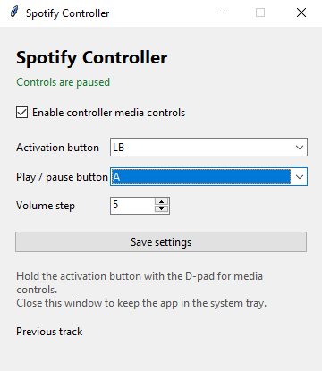

# Spotify Controller

Turn your game controller into a compact media remote for Windows.

**Spotify Controller** lets you change tracks, play or pause music, and adjust
your Windows volume without leaving your game, desk, or sofa. Hold a chosen
controller button, use the D-pad, and carry on.

> Built for Spotify on Windows, but compatible with any app that responds to
> Windows media keys.

## Why use it?

- **No accidental skips** — media commands only work while you hold your chosen
  activation button.
- **Configurable controls** — choose the activation button, play/pause button,
  and volume step from a small desktop window.
- **Stays out of the way** — close the window and the app keeps running in the
  Windows system tray.
- **No account connection** — it uses Windows' normal media controls; no
  Spotify login or API key is needed.
- **Settings are remembered** — your choices are saved automatically for the
  next launch.

## Interface



The compact settings window shows the connected-controller status and lets you
adjust the controls without editing code.

## Default controls

| Controller input | Action |
| --- | --- |
| Hold `LB` + D-pad Left | Previous track |
| Hold `LB` + D-pad Right | Next track |
| Hold `LB` + D-pad Up | Increase Windows volume |
| Hold `LB` + D-pad Down | Decrease Windows volume |
| Hold `LB` + `A` | Play / pause |

`LB` and `A` are only the defaults. The app lets you choose both buttons and
set the volume adjustment between 1% and 25% per press.

## Requirements

- Windows
- Python 3.10 or newer
- A controller recognised by Windows (the included defaults are mapped for an
  Xbox controller)

## Install

Clone the project, open PowerShell in its folder, then install its dependencies:

```powershell
py -m pip install -r requirements.txt
```

## Run

Open Spotify, connect your controller, and start the app:

```powershell
py spotify_controller.py
```

Close the settings window whenever you want—it will remain available from the
system tray. To stop the app completely, right-click the tray icon and select
**Quit**.

## Notes

- Volume controls change the Windows master volume, not only Spotify's volume.
- Track controls are sent to the active Windows media session. If Spotify is
  playing, they control Spotify.
- This project is currently Windows-only because it uses Windows media and
  audio APIs.
